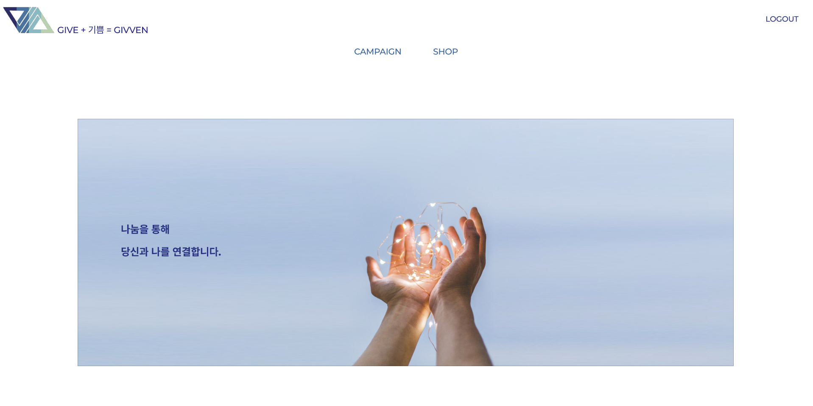
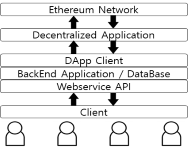
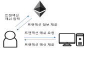

    
    <h3>givven</h3>
	

        블록체인을 이용한 신뢰성 있는 기부 서비스
    

    

	    <a href="https://github.com/who-is-hu/Givven_FE">Givven React application</a>
        &nbsp . &nbsp
	    <a href="https://www.kci.go.kr/kciportal/ci/sereArticleSearch/ciSereArtiView.kci?sereArticleSearchBean.artiId=ART002617143">한국지식정보기술학회 등록 논문</a>
    

     
     
    

## Table of Contents

1. [Description](#Description)
2. [Technical Overview](#Technical-Overview)
   1. [Architecture](#Architecture)
   2. [Trasaction inquiry](#Trasaction-inquiry)
3. [API specification](./GivvenAPI.md)
4. [Thanks to](#Thanks-to)

## Description

Givven은 기부를 하는 기부자, 캠페인을 등록하여 관리하고 기부금을 사용하는 사회단체, 물품을 파는 판매자를 하나의 서비스에 가입시켜 모든 거래 내역을 블록체인에 저장하고 생성된 모든 거래 내역을 누구든 확인할 수 있는 투명한 기부 서비스 입니다.

## Technical Overview

### Architecture

서버는 이용자와 통신하며 이용자에게 웹 서비스를 제공하고, 동시에 DApp의 클라이언트가 되어 서비스 내의 재화의 이동을 블록체인에 기록한다.

그 이유는 완전 탈중앙화된 모델로 서비스를 구현하면 실제 사용자가 어느 정도 이더리움에 대한 지식이 있어야 하고 MetaMask와 같은 플러그인을 설치하여 사용해야 해서 접근성이 떨어지기 때문이다. 

### Transaction inquiry

기부, 충전, 환전, 물품 구매 등 재화가 이동하는 트랜잭션이 일어날 때 해당 트랜잭션의 해쉬를 저장하고 사용자가 요구 시 트랜잭션에 대한 확인이 가능하다.

# Thanks to

숭실대학교 김익수 교수님

숭실대학교 김혜빈 학우님

